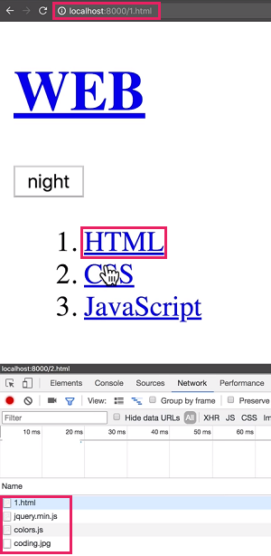
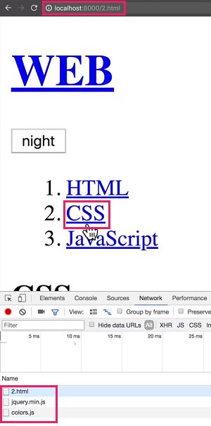
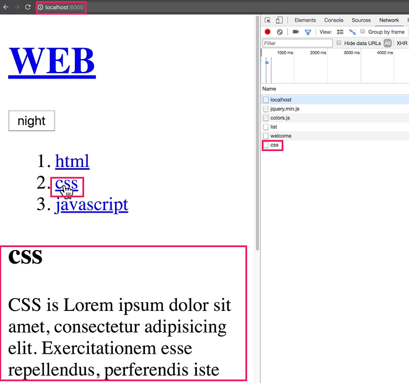
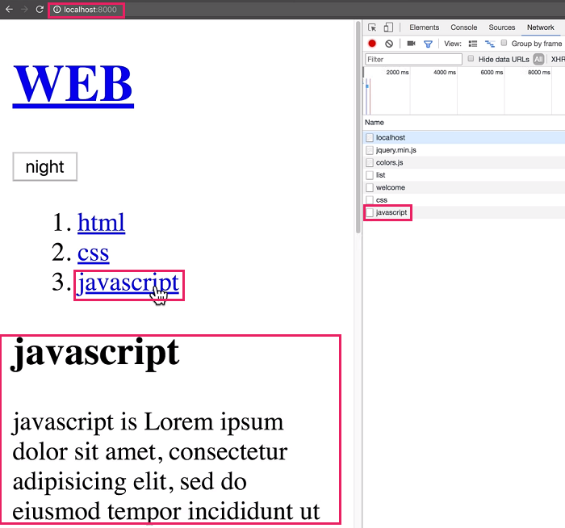
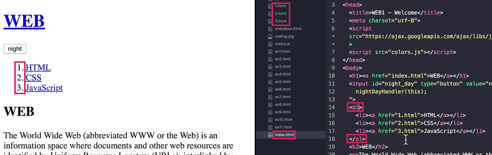
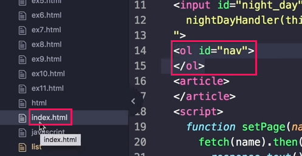

# Ajax
- 부분적으로 웹페이지를 갱신하도록 도와주는 기술
- 웹브라우저가 ajax를 통해서 웹서버와 통신함
- 장점 : 변경된 부분에만 집중할 수 있는 사용성의 증대와 필요한 부분만 로드해 서버와 사용자 입장에서도 시간, 돈, 네트워크 자원이 절약됨
- 개발자도구 Network : 브라우저와 웹서버가 서로 어떠한 정보를 주고받는지(통신)를 모니터링 해줌

## 예시 01
### Ajax를 사용하지 않을 때
- 새로운 페이지를 누를때마다 모든 정보를 다운받음

> 주소가 바뀌고 페이지가 바뀔때마다 모든 정보를 다운받음

### Ajax를 사용했을 때

> 주소의 변경이 없고 아래 내용이 바뀌는 부분에 해당하는 정보만 다운받음

## Ajax의 편리성
- 수작업으로 웹페이지를 수정하는 것은 한계에 봉착한다. 그러나 ajax를 도입하면 단 하나의 index를 재사용한다. 그리고 여기에서 변경이 가능한 부분과 변경이 필요없는 부분을 구분하여 변경될 수 있는 부분만 ajax로 동적으로 변경시켜주면 생산성이 대폭 향상된다.
- 필요한 정보를 서버로 부터 가져와 동적으로 꽂아넣음

## 예시 02
- ol 태그를 ul 태그로 변경
### Ajax를 사용하지 않을 때

> 모든 html 파일의 ol 태그를 일일히 ul 태그로 변경해야 함

### Ajax를 사용했을 때

> 단 하나의 index의 ol 태그만 ul 태그로 변경해주면 모든 페이지가 변경됨

## Single page application
- 예시02 를 통해서 보다시피 ajax를 도입하면 각각의 페이지 모두가 html 파일을 가지고 있을 필요가 없다. 단지, 바뀌는 내용은 컨텐츠만을 컴팩트하게 가질 수 있다. 이러한 효과 즉, 하나의 페이지로 여러정보를 표현할 수 있는 애플리케이션이 Single page application 이다.
