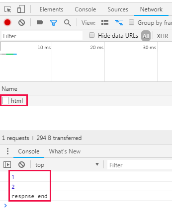
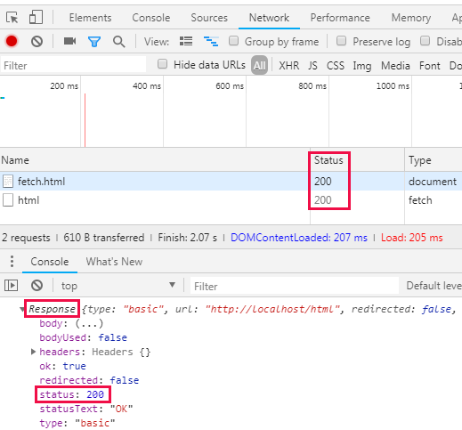

- 서버에 연결이 되어야만 실행가능
## Fetch API
### 사용법
css
```
<h2>CSS</h2>CSS is...
```
fetch.html
```
<input type="button" value="fetch" onclick="
  fetch('css').then(function(response){ 
    response.text().then(function(text){
      alert(text);
    })
  })
">
```
- 코드분석
```
fetch('css')
```
> 서버에게 css라는 파일을 요청하고 응답해주길 명령함
```
alert(text);
```
> 응답이 끝나면 최종적으로 이 부분이 실행됨
```
response.text().then(function(text){...})
```
> 서버가 응답해준 데이터가 text 변수에 담겨있음
```
<article></article>

<input type="button" value="fetch" onclick="
  fetch('css').then(function(response){ 
    response.text().then(function(text){
      document.querySelector('article').innerHTML = text;
    })
  })
">
```
> 버튼을 누르면 article 공간에 css 파일안의 내용이 출력됨

### 원리
- 원리를 알면 자유도가 높아짐
- 원리를 몰라도 사용법만 익히면 사용이 가능하지만 자유도가 떨어짐 자유도에 한계를 느낄때 원리를 파고들어라

#### fetch
- 첫번째 인자로 전달된 데이터를 서버에게 요청함
```
fetch('html');
```
> 버튼을 누를때마다 html에 접속해서 데이터를 가져옴 (개발자도구 Network에서 확인 가능)

#### then
- 서버의 응답이 끝난 후 실행
```
function callbackme(){
  console.log('resopnse end');
}
fetch('html').then(callbackme);
```
> 서버가 응답이 끝나면 callbackme 함수를 실행시켜라
```
function callbackme(){
  console.log('response end');
}
fetch('html').then(callbackme);
console.log(1);
console.log(2);
```
- 결과



- 코드분석
```
fetch('html').then(callbackme);
```
> fetch를 통해 요청하고 then을 통해 callbackme를 호출해달라고 요청해놓은 상태로 명령이 끝나고
```
console.log(1);
console.log(2);
```
> 이 코드들이 쭉 실행이 되다가 웹브라우저가 응답받는것이 끝나면 그때 callbackme 함수를 호출하게 됨
- 여기에서 fetch API는 비동기(Asynchronous)로 실행됨
> fetch('html')가 실행되는 동안 다른 코드들 console.log(1), console.log(2)이 실행됨 즉, 동시에 실행됨

- 만약, 동기(Synchronous)로 실행됐다면 요청이 시작되고 끝날때까지 다른 코드들이 실행되지않고 멈춰있어야 함
> fetch('html')가 응답이 끝날때까지 다른 코드들 console.log(1), console.log(2)이 멈춰있음

### response 객체
- fetch를 통해서 요청했을때 서버가 응답한 결과를 담고있는 객체, 데이터
- 콜백함수가 호출될때 response객체를 입력값으로 줌
```
.then(function(response){...})
```
> then 안에서 독점적으로 사용할 함수는 이름이 필요없어서 익명함수로 사용
```
function callbackme(){
  console.log('respnse end');
}

callbackme = function (){
  console.log('respnse end');
}
```
> 같은 코드
```
fetch('html').then(function(response){
  console.log(response);
});
```
- 결과



- 코드네임
200 : 성공 - 브라우저와 서버가 통신할때 서버가 응답하면서 파일을 잘 찾았다는 의미
404 : not found - 요청한 파일이 존재하지않음을 의미

- response의 속성 중 하나인 status를 이용
```
fetch('javascript').then(function(response){
  if(response.status == '404'){
    alert('Not found')
  }
});
```
> javascript 파일이 없으므로 버튼을 누르면 경고창이 뜸
